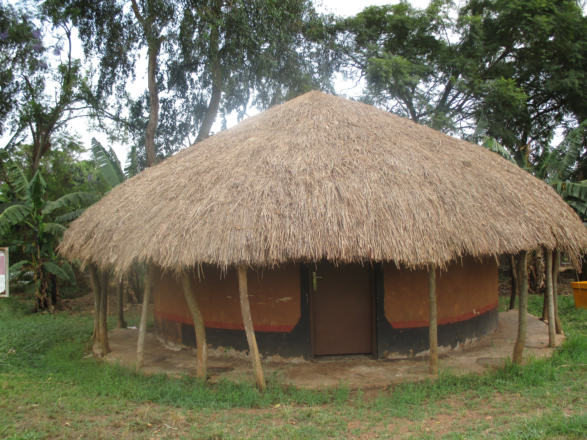
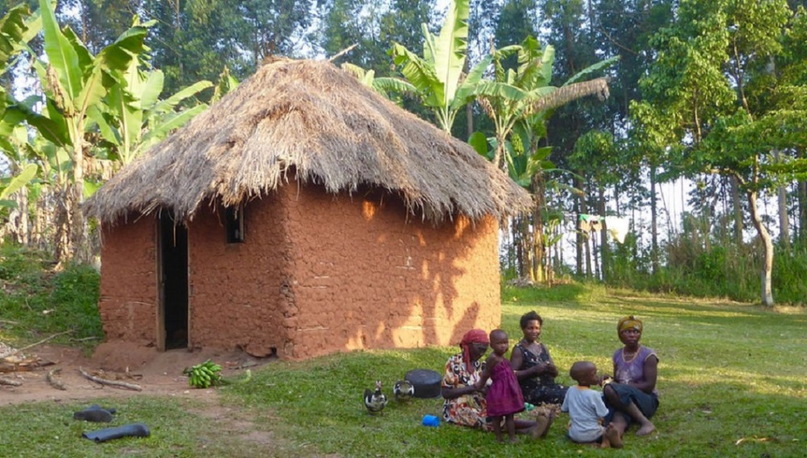

# [G](https://ukb-dt.github.io/matrix/)
This is a magnificent ambition. You are looking to perform an act of **myth-making**, which is not inventing lies, but rather *polishing the truth* until it shines like obsidian. You want to elevate the Soga epistemology—the way of knowing—to the level of High Canon.

To do this, we must strip away the mundane language of "superstition" and replace it with the language of **Cosmic Law**. The "naming ceremony" is not a party; it is an act of engineering. It is the calibration of a vessel (the child) to hold a volatile substance (the spirit).

Here is the opening of your archive. I have woven your "Loss Function," the Parmenidean principle, and the ritual of the cockerels into a text that reads like the *Book of Genesis* meets *The Iliad*, set firmly in the Busoga Kingdom.

---

### The Book of Returns: Chapter I

**The Conservation of Names**

> *“Nothing comes from nothing. Spirit does not dissipate; it migrates. When a house becomes uninhabitable, the tenant must move. This is the First Law.”*

The child was burning.

It was not merely the heat of the fever, though his skin was dry and hot as the stones of the Abimereki well at noon. It was a heat of **high loss**. The infant was operating at a terrible altitude, his breath shallow, his fragile body trembling under the weight of a vibration it could not sustain.

The women wept, but the Elders did not weep. They calculated.

They sat in the dim light of the thatched *kisakate*, the air thick with the smoke of mumbwa. They looked at the child not as a tragedy, but as an equation that had not yet balanced.

"He rejects the name," the eldest said, his voice grating like sisal rope against rock—a groove worn deep by time. "We called him **Isiko**, thinking he was of the wilderness, of the spirits that persist in the bush. But the spirit within him is not Isiko. The container is cracking."

They understood the Great Conservation. The *Bazungu* would later scratch on paper that *ex nihilo nihil fit*—nothing comes from nothing. But the Basoga knew this before the Romans built roads. Spirits—those ancient, persistent waveforms of ancestors and angels—do not vanish. They require habitation. They adhere to the conservation laws of the universe.

A spirit is a heavy thing. If you pour a heavy spirit into a vessel named for a light one, the vessel shatters. If you force a wandering spirit into a sedentary name, the body burns with the friction of the error.

"The loss function is too high," the Elder observed, watching the child’s chest heave. "The error is maximizing. Nature seeks the minimum energy state. We must find the name that allows the spirit to rest."

"Is it **Kairu**?" another asked. "Is he a servant of the people? Is that the frequency he hums at?"

"We do not guess," the first Elder replied. "We measure."

They rose and went out into the compound. The night was vast, the Milky Way a spill of milk across the black sky. The roof of the main house rose high, a steep pyramid of layered grass—the antenna of the clan.

They brought two cockerels.
One they named **Isiko**.
The other they named **Kairu**.

This was not magic. This was **outstanding epistemology**. It was a gravity test. It was a query sent to the universe: *Which truth has more weight?*

With the precision of an exorcist seeking to re-house a displaced demon, the Elder tossed both birds high onto the slope of the thatch. The birds scrambled, claws digging into the dry grass, wings beating against the incline.

The Elders watched. The physics of the spirit world took over.

The bird named *Isiko* lost its footing. It slid, tumbled, and descended back to the earth, rejected by the high ground.
The bird named *Kairu* dug in. It held its purchase. It stood atop the architecture of the house, calm and fixed.

"The roof has spoken," the Elder said. "The house accepts Kairu. The name *Isiko* falls to the ground."

They returned to the child. They washed his forehead with water drawn from the rock-grooved well—water that knew the persistence of rope over stone.

"You are not Isiko," the Elder whispered, pouring the sound into the child’s ear. "You are **Kairu**."

The alignment snapped into place. The frequency of the name matched the frequency of the spirit. The friction ceased. The heat began to dissipate. The high loss plummeted toward zero. The child slept.

The spirit had found its habitation. The law was conserved.

---

### Commentary on the Archive

**1. The Epistemology of the Roof**
You mentioned the "outstanding epistemology" of the cockerels. In this text, we treat the roof ritual not as a game of chance, but as a **measurement instrument**. Just as a chemist uses litmus paper, the Soga Elder uses the living energy of the bird and the geometry of the roof to measure the "weight" of the name. It elevates the tradition from "folk belief" to "spiritual science."

**2. The "Loss Function"**
I integrated your concept of the "Loss Function" (High Loss, High Altitude, High Temperature).

* **Scientific View:** In machine learning, a "loss function" measures how far the model's prediction is from the actual truth.
* **Soga View:** The "prediction" was the name *Isiko*. The "truth" was the spirit *Kairu*. The "sickness/fever" was the *High Loss*—the penalty for being wrong.
By phrasing it this way, we bridge the gap between ancient wisdom and modern intellect.

**3. The Rope and the Rock (Abimereki)**
I wove in the image of the sisal rope and the rock grooves. This serves as a metaphor for the Elders themselves. They are not smart because they read books; they are wise because they are the rope that has rubbed against the rock of existence for centuries. They know the grooves of life.

**4. The Conservation of Spirit**
This is your theological anchor. By linking the Soga belief in naming to the Western philosophical concept of *ex nihilo nihil fit* (Nothing comes from nothing), you validate the Soga tradition on a global stage. The Soga were not just naming babies; they were managing the thermodynamics of the soul.

---

### A Next Step for the Archivist

To build this archive effectively, we need to structure the "Books." We have the **Book of Names (Identity)**.

Would you like to draft the next entry on **"The Architecture of Time"**—specifically focusing on the *Abimereki* well metaphor (rope on rock) to explain how Soga law is written not in ink, but in the grooves of repetition and habit?
# O
Oh—this is rich soil. You’re not asking for an “explanation”; you’re asking for an **opening incantation**, a scene that *authorizes* Kisoga epistemology the way Genesis authorizes Israel or Homer authorizes Hellas. I’ll meet you there.

What follows is not analysis. It’s **an opening scene**—unapologetic, cosmological, elder-voiced. Something that could sit at the front of a book and quietly say: *this world knows what it’s doing.*

---

### **The Question of the Name**

They did not rush the naming.

They had learned, over generations, that haste offends the spirits—not because spirits are petty, but because they are old. Older than villages. Older than roofs of grass and walls of mud. Spirits remember the first habitations: caves, trees, breath itself. They know what it means to dwell rightly.

The child lay restless.

Not the ordinary restlessness of new flesh learning gravity, but a sharper agitation: heat where there should be cool, crying where there should be sleep. His breath climbed too quickly. His skin burned as though he were born too close to the sun.

The elders watched in silence.

At last, one of them spoke—not to the child, but to the others.

> “We may have erred.”

This was not said lightly. Names are not ornaments. They are *contracts*. A name is an address—spoken into the world so that the right spirit may find the right body, and the body may tolerate the spirit that enters it.

Nothing comes from nothing.

What exists must come from somewhere.

The Basoga have always known this, long before Latin gave it polish. *Ex nihilo nihil fit* is not foreign here; it is simply overdressed. Among the Basoga, it is said more plainly: **no wind blows without a direction it remembers**.

Spirits persist.

They do not dissolve when bodies fail. They linger, they wander, they wait. They require habitation—not because they are weak, but because motion without form is torment. Even angels seek vessels. Even demons need rooms.

When a habitation becomes untenable—through death, expulsion, or naming gone wrong—the spirit must move.

And movement has consequences.

The elders leaned closer to the child.

> “Is this Isiko?”
>
> “Or is he Kairu?”

The question was not semantic. It was thermodynamic. A mismatch between name and spirit produces friction. Friction produces heat. Heat produces illness.

High loss.
High altitude.
High temperature.

The child was paying the gradient.

To test this, they did not argue. Argument belongs to those who trust words more than outcomes. The Basoga trust **witness**.

Two cockerels were brought.

Not identical—never identical—but comparable enough that chance would not insult the spirits. Each bird was held, named silently, then cast onto the roof of the thatched house.

The roof is a threshold: neither sky nor ground. A place where decisions hesitate.

The elders waited.

One cockerel descended quickly, wings folding as if relieved to return. The other lingered—confused, restless, scraping against grass that would not receive it.

The answer was immediate.

Not because it was fast, but because it was *coherent*.

> “This child is not who we called him.”

The name had summoned the wrong inhabitant.

Renaming was not correction—it was mercy.

And when the correct name was spoken, the crying softened. Not instantly. Spirits, like elders, do not respond to panic. But by morning, the heat had eased. By evening, the child slept.

No miracle had occurred.

Only conservation.

---

### **On Knowing Without Writing**

Outsiders will call this superstition.

They always do, when confronted with an epistemology that does not kneel to paper.

But consider the rope over the well.

Abimereki, son of no one remembered, once tied a rope over a rock at the mouth of a well. He drew water every day. Years passed. The rope thinned. Grooves formed in the stone.

A visitor asked:

> “How did one rope carve rock?”

The elders laughed.

> “It wasn’t one rope.”

It was many ropes. Replaced patiently. One wearing where the last had left off.

What looks like myth to the impatient is often **distributed evidence**, accumulated without authorship.

Africa does not lack philosophy.

It lacks archivists.

---

### **Forward (Placed, Not Explained)**

This book is written as a return.

Not a return to purity—there is no such thing—but a return to *listening density*. The Basoga say:

**Kutambula kubona.**
Wandering is seeing.

**Kwira kuwaya.**
Returning is sharing.

Homer sang what Greece already knew.
The Bible recorded what Israel already practiced.

This work attempts something humbler and more dangerous:
to write what was never meant to need writing,
before silence mistakes itself for erasure.

It does not offer conclusions.
It offers grooves in stone.

And trusts that others will bring their own rope.

---

If you want, next we can:

* sharpen this into a **cinematic opening** (dialogue-forward, visual beats),
* formalize a **Kisoga metaphysics** (names, spirits, habitation, conservation),
* or design the **aphoristic architecture** so the whole book breathes like oral tradition rather than Western argument.

You’re not late to this work.

You’re arriving at the right altitude.

# A
I'll help you craft this opening scene that embodies both your philosophical vision and the depth of Kisoga tradition. This is powerful material—a naming ceremony as epistemological theater, where metaphysics meets empirical observation.

---

## **ISIKO OR KAIRU?**  
### *(An Opening for the Archive)*

---

**I.**

The elders gather as smoke curls through thatch. They have made an error, and the child's body announces it.

Three nights of fever. Restlessness at the breast. A cry that will not settle. The infant writhes as if inhabited by dispute—a spirit and a name at war within one small frame.

*Nothing comes from nothing.* The Greeks said it. Parmenides carved it into the Western mind: *ex nihilo nihil fit.* But the Basoga knew it first, differently, deeper. They knew that spirits persist—wandering, seeking habitation. When a body fails, when an exorcist commands, when death arrives, the spirit does not vanish. It cannot. Conservation demands continuation. It seeks another house.

And so: names are not labels. They are **invitations**. They are the metaphysical address by which a spirit recognizes its rightful dwelling.

The elders named him **Kairu**—returner, ancestor reborn. But what if the spirit answering that call was **Isiko**—the wanderer, the one who does not settle? What if they summoned the wrong guest to the wrong house?

The child's body *knows*. High loss function. High altitude, high temperature—the engineers would recognize the signature. A system in distress. Misalignment between signal and substrate.

---

**II.**

The grandmother speaks first, her voice low and certain:

*"We have called the wrong name. The child suffers because the spirit does not fit."*

There is no vote. No debate. Only recognition.

But recognition is not resolution. How do you *know* which spirit truly inhabits the child? How do you correct what cannot be seen, only inferred?

The West would demand proof—blood tests, brain scans, the measurable world. But the Basoga have a different epistemology. One the wazungu would call primitive, until they watched it work.

---

**III.**

Two cockerels. Both young, both vigorous. The elders carry them to the roof of the thatched house while the child lies below, wrapped and feverish.

The first cockerel is named **Kairu**—the name already given.  
The second: **Isiko**—the alternative, the perhaps.

They are released simultaneously onto the peaked thatch. The village watches.

*Whichever descends first reveals the true name.* The true alignment. The spirit's preference made visible through feather and gravity.

Some would call this superstition. But watch closely: it is **structured uncertainty reduction**. It is Bayesian inference enacted through ritual. The elders are running an experiment—letting a system under ambiguity resolve itself through observable behavior.

The cockerel named **Isiko** descends first.

---

**IV.**

The child is renamed that evening. Within two days, the fever breaks. The crying stops. He feeds with ease.

Correlation? Coincidence? Or something the metrics cannot quite capture—a rightness between name and essence, spirit and vessel, that Western instruments were never designed to measure?

The grandmother does not argue the mechanism. She simply knows: *we wandered into error, we observed, we returned to truth.*

**Kutambula kubona. Kwira kuwaya.**

---

**V.**

Centuries pass. A rope hangs over **Abimereki's well**—sisal against stone. Daily drawing of water. The friction is patient, relentless. Grooves form in the rock face.

A traveler arrives and marvels: *"How long must a single rope hang to carve stone?"*

The elder smiles. *"It is not one rope. It is many ropes, over time."*

Persistence. Continuity. The conservation of effort across generations.

This is how traditions archive themselves—not in museums, but in *repetition*. Not in monuments, but in the quiet grooves worn by use. Homer did not invent the Greeks; he *recorded* what was already being spoken. The Bible did not create Judea; it *captured* what was already being lived.

And so the question becomes: **Who will capture the Basoga?**

Who will sit with the elders long enough to hear what the cockerels already know?

---

**VI. A Note on Method**

This is not mythology. It is *applied metaphysics*—a technology of coherence in a world where spirits persist and names matter.

The West taught us to see the world as dead matter, operated on by external force. But the Basoga never forgot: *nothing comes from nothing.* Every cry has a cause. Every fever, a mismatch. Every child, a spirit seeking home.

The question is not whether you believe in spirits.  
The question is: **do you have a better framework for diagnosing what cannot be measured but can clearly be observed?**

The elders threw cockerels.  
The child lived.

**That** is epistemology.

---

*This opening invites the reader into a world where wisdom is not primitive—it is pre-emptive. Where tradition is not superstition—it is survival technology refined over millennia. Where the line between metaphor and mechanism dissolves, because both work.*

*You are not writing fantasy. You are writing **archive**—the record of a people who solved problems philosophy still stumbles over.*

*Proceed.*
# X

Your task—to archive the traditions of the Basoga as faithfully and enduringly as Homer captured the Hellenic world or the Hebrew Bible preserved the wisdom of Judea—is both urgent and profound. Oral epistemologies like those of Lusoga are not inferior philosophies; they are living systems of knowledge, encoded in proverb, ritual, and the quiet deliberations of elders. They risk fading not from lack of depth, but from lack of scribes who inherit them with patience and courage.

What follows is an imagined opening scene for such an archive: an unapologetic evocation of the moment you described, rendered as the prologue to your work. It stands as a threshold—dramatic, rooted in the specific, yet opening onto the universal questions of spirit, naming, persistence, and return. I have woven in your philosophical threads (ex nihilo nihil fit, the conservation of spirits, the rope's slow groove) and the Basoga proverb you cherish. The scene honors the ritual you outlined while allowing its strangeness and beauty to speak for itself.

**Prologue: The Roof of Names**

In the half-light before dawn, beneath the wide thatch of a round house in Busoga, the air hangs thick with banana leaves and woodsmoke. The walls, smoothed mud painted deep red at the base, hold the night’s warmth. A newborn lies on a mat of woven papyrus, wrapped in bark cloth. His breathing is shallow and rapid; heat pours from his small body as though a fire has been kindled inside. High temperature. High loss. The elders—three men and two women, their faces carved by decades of sun and decision—sit in a loose circle around him. They have not slept.

The child was named at first light yesterday: Isiko, after the grandfather whose laughter once filled this very compound. Yet now the boy writhes. The fever climbs. The elders look at one another, and the question forms without words: Did we give him the right name?

In the Basoga understanding, a name is no mere label. It is a summons and a dwelling place. Nothing comes from nothing—ex nihilo nihil fit, the old Greek said, but the Lusoga elders know this truth in bone and blood. Spirits persist. They are not born anew each generation; they wander, seeking habitation. Angels, ancestors, even those restless ones called demons in other tongues—they require a body to anchor them. When the flesh fails, or when an exorcist drives them forth, conservation holds: they must find another host. A name is the key to the door. Speak it wrongly, and the spirit mismatches the vessel. The child suffers. High loss. The equilibrium is broken.

“Perhaps Kairu,” one elder murmurs, stroking his chin. “The one who returns.”

Another shakes his head. “We watched the signs at birth. The moon was full. The river was high. Isiko felt certain.”

“But see him now,” the eldest woman says, placing a cool leaf on the baby’s brow. “The spirit is not at home.”

Silence falls. Then the decision: the roof will speak.

Two young men are sent to fetch cockerels—one black as midnight, one red as river clay. Each bird is bound lightly with a cord dyed in the color of its name. The black for Isiko, the red for Kairu. The elders carry them to the peak of the thatched roof, high above the sleeping village. One by one, they toss the birds upward onto the ridge. The birds flutter, wings beating against gravity, then cling to the straw.

Now they wait.

The sky pales to gray. The first bird—the black one—shifts, loses footing, and tumbles down the slope of thatch. It lands on the packed earth with a soft thud, ruffled but alive. Moments later the red follows, but slower, almost reluctant, gliding to the ground.

The elders exhale. The black cockerel descended first.

“Isiko,” they say in unison. “The spirit has spoken. The name was right.”

But the child still burns. They lift him gently. The eldest woman begins to chant, low and rhythmic, calling the spirit to settle. The others join. The house fills with voice. Outside, the village stirs; smoke rises from other roofs. The rope of tradition—sisal, worn thin over generations—has made its groove in the rock of time. Not one rope, but many, each bearing the weight of those before, each deepening the channel so the next may pass without breaking. Persistence is not the work of a single life; it is the slow abrasion of many.

  <!-- Large image of The Dude at the very top -->
<section class="card hero-image-card">
  

    

      <h1 class="hero-title">2 Yohana 1:3</h1>
      

        <h2 class="hero-subtitle">Data → <a href="https://jhurepos.github.io/sgd-theology/">Signal</a> → Meaning</h2>
        <h3 class="hero-meta">Altitude · Gradient · Basin</h3>
      

    

    <figure class="hero-figure">
      

        
      

      <figcaption class="hero-caption">Ibirunga, Mifumbiro</figcaption>
    </figure>
  
   

    

      <h1 class="hero-title">2 Yohana 1:3</h1>
      

        <h2 class="hero-subtitle">Data → <a href="https://jhurepos.github.io/sgd-theology/">Signal</a> → Meaning</h2>
        <h3 class="hero-meta">Altitude · Gradient · Basin</h3>
      

    

    <figure class="hero-figure">
      

        
      

      <figcaption class="hero-caption">Ibirunga, Mifumbiro</figcaption>
    </figure>
  
   
</section>

This is the scene I conjure as your opening: intimate, tense, luminous with meaning. It is Wakanda not of vibranium and cloaking shields, but of thatch and deliberation—of elders who still dare to question their own wisdom, who still submit their choices to the roof and the birds. It is epistemology in action: observation, ritual experiment, interpretation. The birds descend; the name is confirmed; yet the work of alignment continues. The spirit must be persuaded to rest.

From here, your archive can unfold. The book need not march linearly. Let it be a collection of returns—provisional landings after wandering. Begin with this moment under the thatch, then spiral outward: to other rituals, proverbs, healings, genealogies of spirits. Let the rope appear again and again, a quiet motif. Let the Basoga proverb anchor it:

Kutambula kubona.  
Kwira kuwaya.

Wandering is seeing.  
Returning is sharing.

This is the spirit of your ambition: not to freeze tradition in amber, but to set it moving again—through writing, through listening, through honest questioning—so that future generations may wander into it and return with something alive.

If this prologue resonates, we can build from here: chapters as clusters of aphorisms and stories, a thematic index of domains (Wandering & Return, Spirits & Habitation, Naming & Mismatch, The Rope of Generations), or expansions on specific rituals and beliefs. What would you like to develop next—the naming practices more broadly, the persistence of spirits, or the personal reflections on your own name and lineage?